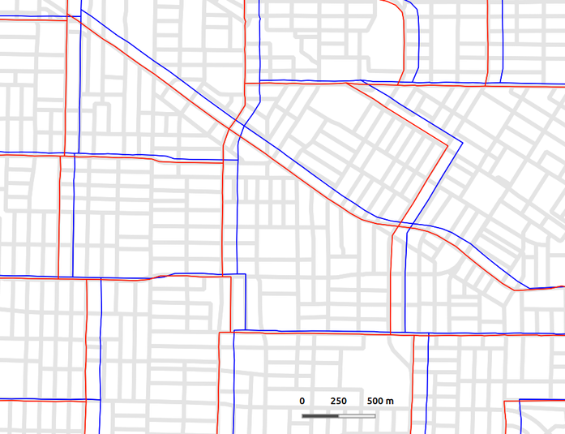

## Conflation procedure for fixing boundary mismatch in the 1991 & 1996 Canadian censuses

The geographic boundary files for the 1991 and 1996 Canadian censuses contain substantial spatial mismatch error.

Our procedure uses a spatially weighted average (i.e. similar to a *moving window* approach) to translate each coordinate in the spatial files of 1991 and 1996 censuses via referencing a much smaller set of accurately translated control points. Currently this process is only set up to work in urban areas (i.e. CMAs)

**translate_points.py** converts coordinates in a point file, like the block-face points, using the points in **control_points.csv** as reference.

**translate_topojs.py** does the same but to spatial boundaries stored in a topojson object.

Corrected data are included in the **conflated_boundaries** as well as being uploaded to [Dataverse](https://dataverse.scholarsportal.info/dataverse/corrected_census_boundaries_1991_1996)

The image below is sample of the output of corrected census tracts for 1996. The blue lines are the original boundaries while the red are the conflated boundaries, which align much closer to the underlying 2016 census blocks.

